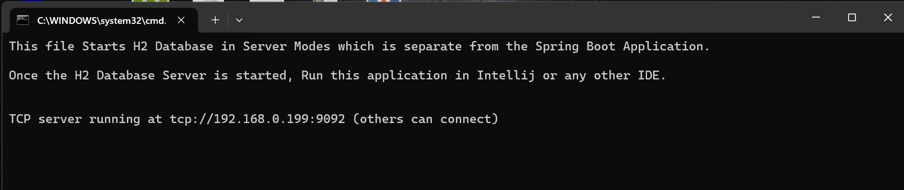

# Flyway Sample Project for Banking Application

## Overview

Flyway is a tool that helps manage database migrations in any project. 

A `migration` refers to the process of changing the database schema over time (e.g., creating tables, modifying columns, etc.).

Flyway allows to write migration scripts `(SQL scripts)` that Flyway will run automatically when the application starts, ensuring that the database schema is always in the right state.

This project demonstrates how to use Flyway in a Spring Boot application with H2 as the database. The project is structured to gradually introduce various Flyway concepts, starting from simple migrations to more advanced database operations like stored procedures and complex transactions.


## Understanding Project - Flyway Migrations

This project showcases how to use Flyway Migrations while application development. We have integrated Flyway Migration Scripts with Spring Boot and H2 Database.  
We have not used H2 DB as in-memory database (which is usually the case). This is because we wanted to showcase Flyway Migrations can be used even without running any Java application.


In this project we have shown 3 ways to use Flyway Migration
1. At Application Startup.
2. Via Maven Command.
3. Programmatically.

By default, when you start H2 DB in Server Mode and Start the Application. Nothing will be present in DB.  
You will notice a schema `default-schema` with only one table `flyway_schema_history`.  
`flyway_schema_history` table is a core component that Flyway uses to track the status and progress of applied migrations. This table ensures that Flyway can manage and synchronize your database schema effectively.  
`flyway_schema_history` is a meta table that Flyway automatically creates in your database to store the history of executed migrations.  


Purpose:  
  - Keeps a record of all the migrations that have been applied.
  - Ensures that each migration is applied only once (avoiding duplicate runs).
  - Helps Flyway verify the current state of your database schema.

Structure of `flyway_schema_history`  
The table has predefined columns with specific purposes. Below are the important ones:

| **Column Name**     | **Description**                                                                                     |
|----------------------|-----------------------------------------------------------------------------------------------------|
| `installed_rank`     | The order in which migrations were applied.                                                        |
| `version`            | The version number of the migration (from the file name, e.g., `V1.0.0__init.sql`).                 |
| `description`        | A human-readable description of the migration (from the file name or explicitly provided).          |
| `type`               | The type of migration (e.g., `SQL`, `JDBC`, `SCRIPT`).                                              |
| `script`             | The name of the migration script file (e.g., `V1_0__init.sql`).                                     |
| `checksum`           | A checksum to detect if the migration script has changed since it was applied.                     |
| `installed_by`       | The user who applied the migration.                                                                |
| `installed_on`       | A timestamp of when the migration was applied.                                                     |
| `execution_time`     | Time taken (in milliseconds) to apply the migration.                                               |
| `success`            | Whether the migration was applied successfully (`TRUE`) or not (`FALSE`).                          |


Let's discuss all the 3 approaches to execute Flyway Scripts in detail now.

### Approach-1: Flyway Migration at Application Startup

In this approach, all the Flyway migration scripts are placed in a designated folder (usually `db/migration`) before starting the application. 
When the application starts, Flyway automatically scans this folder, locates the scripts, and executes them sequentially to apply the required database changes. 
These scripts are processed in the order defined by their version numbers (e.g., `V1__init.sql`, `V2__add_column.sql`), ensuring that the database schema is built or updated correctly.

During this process:

  - **Baseline Creation**: If the database is empty or a baseline version is specified, Flyway applies the scripts to create a baseline schema. This ensures consistency for subsequent migrations.
  - **Schema Synchronization**: Flyway tracks applied migrations using its internal table (`flyway_schema_history`) and only executes new or unapplied migrations. This avoids duplicate operations.
  - **Application Startup**: Once the migrations are complete, the application server initializes, and the Java application connects to the updated database.

In case of this application we have changed the name of the default folder where we keep migration files for avoid confusion with other cases of migrating db. 
To handle the current case for migration at application start we have defined a dedicated folder called `default_migration` via environment property `spring.flyway.locations=classpath:db/default_migration`, 
additionally at db level we have made three separate schemas to differentiate between these three cases. 
For current case we have created a schema called `default-schema` via environment property `spring.flyway.schemas=default-schema`.

In order to test this default approach of db migration via Flyway Migration Scripts at application start, copy some files from `resources/db/samples/1. basic` to `resources/db/default_migration` and start the application.
Once done, open the H2 DB Console and navigate to `default-schema`, you will notice new tables been created, data inserted and the records for these migration scripts successful run in table `flyway_schema_history`.


### Approach-2: Flyway Migration via Maven Command.

In this approach, Flyway migrations are executed manually using a Maven command. This method provides flexibility, allowing you to control when migrations are applied, rather than having them automatically run during application startup.

To set this up, ensure that Flyway is properly configured in project’s `pom.xml` file. You will need to include the Flyway plugin under the `<plugins>` section. 
Here’s an example of the configuration:

  ```xml
    <!-- Flyway Maven Plugin Configuration -->
    <plugin>
        <groupId>org.flywaydb</groupId>
        <artifactId>flyway-maven-plugin</artifactId>
        <version>10.10.0</version>
        <configuration>
            <url>jdbc:h2:tcp://localhost/./src/main/resources/db/flyway-poc-db;AUTO_SERVER=TRUE</url><!-- H2 Server Mode URL -->
            <user>sa</user>
            <schemas>
                <schema>plugin-schema</schema>
            </schemas>
            <locations>
                <location>filesystem:src/main/resources/db/plugin_migration</location>
            </locations>
        </configuration>
        <executions>
            <execution>
                <goals>
                    <goal>migrate</goal>
                </goals>
            </execution>
        </executions>
    </plugin>
  ```
Once this is configured, you can use the following Maven command to apply the migrations:
 ```bash
    mvn flyway:migrate
 ```
This command will instruct Flyway to connect to the database and apply any pending migrations based on the scripts located in the specified folder (e.g., `src/main/resources/db/migration`). 
Flyway will check the current state of the database, and only execute migrations that have not yet been applied, ensuring your database schema is always up-to-date.

This approach is particularly useful during development, testing, or **CI/CD (Continuous Integration/Continuous Deployment)** processes where you need explicit control over the migration process. 
You can also use other Flyway Maven goals like `flyway:clean` (to drop all objects in the schema), `flyway:info` (to display migration history), and `flyway:repair` (to repair the metadata table).

By running migrations manually via Maven, you maintain full control over when and how migrations are applied, which is especially useful in more complex environments or during controlled deployment phases.

In case of this application we have changed the name of the folder where we keep migration files for avoid confusion with other cases of migrating db.
To handle the current case for migration via Maven Commands we have defined a dedicated folder called `plugin_migration` via xml field below,
 ```xml
    <locations>
        <location>filesystem:src/main/resources/db/plugin_migration</location>
    </locations>
 ```
additionally at db level for current case we have created a schema called `plugin-schema` via xml field below.
 ```xml
    <schemas>
        <schema>plugin-schema</schema>
    </schemas>
 ```

In order to test this approach of db migration via Maven Commands, copy some files from `resources/db/samples/2. intermediate` to `resources/db/plugin_migration` and start the application.
Once done, execute Maven Command mvn `flyway:migrate`, then open the H2 DB Console and navigate to `plugin-schema`, you will notice new tables been created, data inserted and the records for these migration scripts successful run in table `flyway_schema_history`.


### Approach-3: Flyway Migration programmatically.

In this approach, Flyway migrations are executed programmatically within your application, allowing complete flexibility and control over when and how migrations are applied. 
This can be useful when you want to trigger migrations on-demand or as part of a specific application logic flow, such as in response to a user action or at a particular point during the application runtime.

This method is especially useful when you need more control over the migration process during runtime or for scenarios where migrations need to be triggered on demand (e.g., for special administrative tasks, user-triggered events, or automated scripts during the lifecycle of the application). 
It also provides flexibility to apply migrations at specific points in your application’s workflow, unlike the other methods that run migrations automatically or via external tools.

To achieve this, you typically use the Flyway API directly in your Java code. The following example demonstrates how to integrate Flyway migrations within a Spring Boot application:

**Example: Programmatically Triggering Migrations via REST Endpoint**

In this approach, a REST endpoint is created to trigger the migration process. This allows you to manually invoke database migrations whenever necessary. 
Here's how you can implement it:  

**Controller to Trigger Migrations**
 ```java
    @RestController
    @RequestMapping("/migrate-db")
    public class FlywayMigrationController {
    
        private final FlywayMigrationService flywayMigrationService;
    
        public FlywayMigrationController(FlywayMigrationService flywayMigrationService) {
            this.flywayMigrationService = flywayMigrationService;
        }
    
        @GetMapping("/run-migration")
        public String runMigrations() {
            return flywayMigrationService.migrateDatabase();
        }
    }

 ```
The above code defines a Spring REST controller that exposes an endpoint (`/migrate-db/run-migration`) to trigger the migration process. 
When this endpoint is accessed, it calls the `FlywayMigrationService` to perform the database migrations.


**Service for Handling Migrations**

```java
    @Service
    public class FlywayMigrationService {
    
        public String migrateDatabase() {
            Flyway flyway = Flyway.configure()
                    .dataSource("jdbc:h2:tcp://localhost/./src/main/resources/db/flyway-poc-db", "sa", "")
                    .schemas("programmatic-schema")
                    .locations("classpath:db/programmatic_migration")
                    .load();
    
            try {
                flyway.repair(); // Repair schema history
                flyway.migrate(); // Apply migrations
                return "Flyway Migrations Successfully RAN !!!";
            } catch (Exception e) {
                return "Error running Flyway migrations: " + e.getMessage();
            }
        }
    }
```
The `FlywayMigrationService` creates a Flyway instance configured with a data source, schema, and migration location. 
The `migrateDatabase` method runs the migrations and repairs the schema history if necessary. 
It returns a success message if the migrations were successful, or an error message if something went wrong.


**Callbacks for Additional Logic**

You can also define custom Flyway callbacks to run additional logic before or after migrations. 
For example, you can log migration events, validate the database schema, or call external services. 

Here's an example of a callback implementation:
```java
    public class DBMigrationCallback implements Callback {
        private static final Logger LOGGER = LoggerFactory.getLogger(DBMigrationCallback.class);
    
        @Override
        public void handle(Event event, Context context) {
            switch (event) {
                case BEFORE_MIGRATE:
                    LOGGER.info("Migration starting for script: {}", context.getMigrationInfo().getScript());
                    break;
                case AFTER_MIGRATE:
                    LOGGER.info("Migration completed for schema: {}", context.getStatement());
                    callExternalSystem();
                    break;
                default:
                    break;
            }
        }
    
        private void callExternalSystem() {
            LOGGER.info("Notifying external system...");
            // External system call logic goes here
        }
    
        @Override
        public String getCallbackName() {
            return "DBMigrationCallback";
        }
    
        @Override
        public boolean canHandleInTransaction(Event event, Context context) {
            return true;
        }
    }
```
In this callback, we log events before and after migrations, and we demonstrate calling an external system once the migration completes.


### Callbacks

Callbacks are special `hooks` that can be used with Flyway to run custom code at specific points during the migration process.

These points could be before or after a migration is applied, allowing to do things like logging, data validation, or even modifying the environment.

Think of callbacks as special `"events"` that occur during the migration process, where we can tell Flyway to trigger specific actions at those moments.

**`DBMigrationCallback.java`** (Java-based callback) - refer callback package in java source code
- This is a custom Flyway callback used to hook into different points of the database migration process.
- It allows us to perform actions before, during, and after migration scripts are executed.
- **Key Features:**
    - **Before Migration:** Logs the start of each migration and allows pre-migration checks.
    - **After Migration:** Logs when a migration is completed and can trigger actions like notifying external systems.
    - **After Each Migration:** Logs the completion of each individual migration script.
    - **After Validation:** Logs the completion of migration validation to ensure scripts are in the correct order.
    - **After Migration Applied:** Runs cleanup or finalization tasks after all migrations are successfully applied.


    
### Flyway Concepts Covered
- DDL (Creating tables, altering columns)
- DML (Inserting, updating, and deleting data)
- Complex operations (Stored procedures, transactions)


### Flyway Script Naming Conventions: V__, U__, and R__

Flyway uses a structured naming convention for migration scripts, allowing developers to manage database changes systematically and reliably. Below is an explanation of the significance and purpose of scripts prefixed with V__, U__, and R__.

- **V__ (Versioned Scripts)**
  - **Purpose:** These scripts define versioned migrations that represent specific changes applied sequentially to the database schema or data.
  - **Usage:** Scripts with this prefix, such as V1__Create_customer_table.sql or V2__Insert_initial_data.sql, introduce changes like creating tables, altering schemas, or inserting initial data.
  - **Significance:**
  - **Sequential Execution:** Versioned scripts execute in the order of their version numbers, ensuring incremental updates to the database.
   - **Audit Trail:** Flyway records each version applied in a schema history table, making it easy to track migrations.


- **U__ (Undo Scripts)**
  - **Purpose:** Undo scripts are optional and allow for manual rollback of versioned migrations in case of errors or a need to revert changes.
  - **Usage:** A script like U1__Undo_create_customer_table.sql can be used to reverse the effects of a migration (e.g., dropping a table or removing inserted data).
  - **Significance:**
  - **Controlled Rollback:** Provides a structured way to undo changes without relying on ad hoc solutions.
  - **Testing and Development:** Useful during iterative development or testing phases when frequent schema adjustments are required.


- **R__ (Repeatable Scripts)**
   - **Purpose:** These scripts define repeatable migrations that can be re-applied as needed, making them ideal for maintaining database objects like views, stored procedures, or functions.
   - **Usage:** For example, R__Rebuild_materialized_view.sql can recreate or refresh a materialized view whenever underlying data changes.
   - **Significance:**
   - **Always Up-to-Date:** Repeatable migrations ensure that non-versioned database objects remain current with the latest logic.
   - **No Versioning:** Unlike versioned scripts, they are identified by their checksum, meaning they are re-applied only if their contents change.


### Prerequisites
- Java 8 or above
- Maven
- Spring Boot


## Project Structure

Sample migration scripts are provided to experience how Flyway migration are writen and executed. 

All the sample scripts are available in `sample` folder, under `resources`.

The sample migration scripts are divided into 5 different folders (`basic`, `intermediate`, `advance`, `programmatic migration`, and `extra migrations`) to help users understand Flyway step by step. 

Start with the basic folder and progressively move to more complex scenarios.


### Basic Folder
1. **V1__Create_customer_table.sql**: Creates the `customer` table.
2. **V2__Insert_initial_data.sql**: Inserts initial customer data.
3. **V3__Add_non_null_column_to_customer.sql**: Adds a `phone_number` column to the `customer` table, first nullable, then setting it as `NOT NULL` after back filling.
4. **V4__Add_index_to_customer_email.sql**: Adds an index to the `email` column in the `customer` table.

### Intermediate Folder
1. **V5__Create_account_table.sql**: Creates the `account` table with a foreign key to `customer`.
2. **V6__Insert_account_data.sql**: Inserts initial account data.
3. **V7__Alter_account_table_add_account_type.sql**: Adds an `account_type` column to the `account` table, with a default value and `NOT NULL` constraint.
4. **V8__Add_foreign_key_to_account_table.sql**: Adds a foreign key constraint to the `account` table, linking it to the `customer` table.


### Advance Folder
1. **V9__Add_stored_procedure.sql**: Creates a Stored Procedure called `get_customer_by_account` in the database. This procedure is designed to retrieve a `customer’s` full name based on an account number.
2. **V10__Complex_transaction_procedure.sql**: Creates a Stored Procedure called `transfer_money`, which facilitates transferring funds between two accounts. This procedure takes three input parameters:
- `from_account` (source account number),
- `to_account` (destination account number),
- `amount` (the amount to transfer as a decimal value with two decimal places).
  This procedure ensures that the transfer happens atomically—either both accounts are updated, or an error is raised, keeping the database consistent. It’s particularly useful for preventing partial updates during a transfer.


### Programmatic Folder
1. **V11__Create_employee_table.sql**: Creates the `employee` table.
2. **V12__Insert_employee_data.sql**: Inserts two records into `employee` table.
3. **V13__Add_salary_column_to_employee.sql**: Performs an ALTER TABLE operation to modify the `employee` table by adding a new `salary` column.
4. **R__Rebuild_employee_index.sql**: Ensures the index on the `employee` table's `name` column is updated or recreated if its definition changes.
5. **U__Undo_add_salary_column_to_employee.sql**: Reverts the migration that added the `salary` column to the `employee` table, useful if the change is no longer needed or was applied in error.


### Extra Migration Folder
1. **V1__Create_bank_table.sql**: Creates the `bank` table
2. **V2__Alter_bank_table_add_column.sql**: Modifies existing `bank` table by adding a new column `established_year`.
3. **V3__Add_index_to_bank_table.sql**: Creates an index on `name` column of the `bank` table.
4. **V4__Drop_bank_table.sql**: Deletes the `bank` table from the database
5. **R__Recreate_bank_index.sql**: Ensures that the index on the `name` column of the `bank` table remains up-to-date. This script can be reapplied whenever the `bank` table changes or the index definition needs to be modified.
6. **R__Refresh_bank_materialized_view.sql**: Maintains a materialized view that summarizes the number of branches for each bank. This script can be reapplied as needed whenever there are changes in the underlying `bank` table.
7. **R__Refresh_bank_summary_view.sql**: Provides a reusable summary of the number of branches and the earliest year of establishment for each bank. The script can be reapplied whenever there are structural or data updates to the `bank` table.
8. **U__Undo_add_established_year_column.sql**: Reverts the addition of the `established_year` column, undoing the migration if it is no longer required or was introduced in error.
9. **U__Undo_create_bank_table.sql**: Fully removes the `bank` table, including any dependencies like foreign keys or indexes.
10. **U__Undo_drop_bank_table.sql**: Restores the `bank` table after it was dropped, recreating the structure and reintroducing some sample data for development or testing purposes.


## Programmatic DB Migration (Java Package)

This folder contains examples that demonstrate how to automate Flyway database migrations programmatically within a Java Spring Boot application. These examples showcase different ways to configure and trigger Flyway migrations via code, handling scenarios like migration failures.

1. **FlywayMigrationConfig.java**:
   - A Java-based configuration that automatically triggers Flyway migrations during application startup.
   - It demonstrates how to programmatically achieve the same behavior of executing all Flyway migrations before the application starts.


2. **FlywayMigrationController.java**: 
   - Controller to demonstrate Flyway database migrations programmatically. 
   - This REST controller exposes an endpoint that triggers Flyway migrations when called.

2. **FlywayMigrationService.java**:
   - Service class responsible for managing Flyway database migrations programmatically.
   - Programmatically control when migrations are applied and handle migration failures.


## Running the Project

1. Clone the repository:
    ```bash
    git clone https://github.com/gauravsaxena1611/Flyway-POC.git
    cd Flyway-POC
    ```

2. Start H2 DB in Server Mode.  
   Look for file `start-app.cmd` and double-click on it.   
   This will open a command prompt displaying some messages to help you understand steps.  
   Look for the below logs.  
   
    ```bash
    This file Starts H2 Database in Server Modes which is separate from the Spring Boot Application.
    Once the H2 Database Server is started, Run this application in Intellij or any other IDE.
    TCP server running at tcp://192.168.0.199:9092 (others can connect)
    ```
   
   This indicated our H2 server is now started..
   


3. Build and Run the Spring Boot application.
    ```bash
    mvn clean package
    mvn spring-boot:run
    ```


4. Open H2 Console using below URL.  
   Remember to use JDBC URL : `jdbc:h2:tcp://localhost/./src/main/resources/db/flyway-poc-db`  
   User-Name: `sa`  
   Password: `<blank>` do not enter anything  
    ```bash
    http://localhost:8080/h2-console
    ```
   As this setup is starting H2 DB in server mode all your previous updates are saved locally in files  
   Navigate to `src\main\resources\db` and look for files `flyway-poc-db.lock.db` and `flyway-poc-db.mv.db`.  


   - `flyway-poc-db.mv.db` - Main database file.  
   .mv.db stands for Multi-Version Database.  
   Stores actual data of H2 database - tables, indexes, and any schema information.  
   Used for persistent storage so that data remains available even after the database server is shut down.  
   Do not modify this file manually as it could corrupt your database.  
   Do NOT delete this file if you need the data in your database.  
   Deleting this file will erase all your database data.  
   Back up the .mv.db file regularly to safeguard your data.  
   Avoid opening the .mv.db file in other tools while the H2 database is running to prevent corruption.  


   - `flyway-poc-db.lock.db` - Lock file that prevents multiple processes or instances from accessing the same database simultaneously.  
   Contains metadata indicating which process is currently accessing the database.  
   Used to manage concurrency and prevent conflicts like multiple writers to the database at the same time.  
   It is a temporary file created when the database is in use (when the H2 server or a client process connects to the database). Automatically deleted when the database is properly shut down.  
   This file is safe to delete only if the database is not running, if the H2 server was not shut down properly, the lock file remains.  
   If you try to delete it while the database is running, you may corrupt your database.  
   Always shut down the H2 database properly to ensure the .lock.db file is removed cleanly.  


   - Key Scenarios  
     - When the H2 server is running:  
       - Both files will exist (`.mv.db` for data, `.lock.db` for process lock).
     - When the H2 server is stopped properly:  
       - The `.lock.db` file will be deleted automatically, leaving only the `.mv.db` file.  

    
5. Follow below section to Run and Understand Flyway Migration.  
   Apply the migrations in sequence by checking the different folders.  
   Start with the `basic` folder, then move to `intermediate`, `advance`, `programmatic_migration` and finally `extra_migrations`.


By following the sequence of migrations, you will learn the core features of Flyway and gain expertise in applying database migrations and using callbacks for advanced database management.


good video to follow - https://www.youtube.com/watch?v=dJDBP7pPA-o
